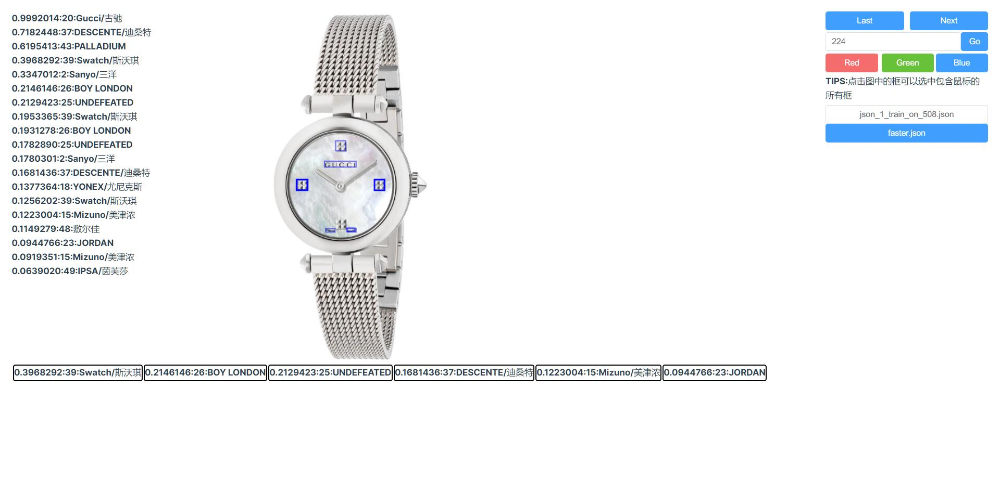

# COCO Detection Visualization

一个简单的基于VUE3和Elementui的交互式COCO输出可视化工具,支持框到标注和标注到框的双向选择. 后端使用python的flask库实现.



# 依赖:
- Python 3
- flask
- flask-cors
- opencv2
- npm>6.0

# 数据准备
1. 将需要可视化的json文件置于./jsons文件夹下,供后端自动识别
2. 将图像文件软链接或者复制到./static/images/

完成数据准备后的两个文件夹如下
```
-jsons/
--json1.json
--json2.json
-static/
--images/
---1.jpg
---2.jpg
```

# 运行
启动前端:
```sh
#前端端口默认为3000
npm install
npm run dev
```
启动后端:
```sh
#后端端口默认为5000
python app.py
```
如果后端端口有改动,需要在src/App.vue中修改backend_url,后续考虑加入配置功能.